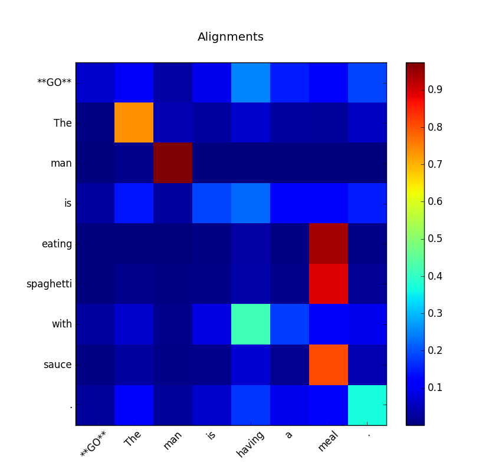

Decomposable Neural Network Models for Natural Language Inference
=================================================================

This code is a Tensorflow implementation of the models described in
`A Decomposable Attention Model for Natural Language Inference`__ and `Enhancing and Combining Sequential and Tree LSTM for Natural Language Inference <https://arxiv.org/abs/1609.06038>`_ (for the latter, only the sequential model is implemented).

.. __: https://arxiv.org/abs/1606.01933

This architecture is composed of three main steps:

1. **Align.** This steps finds word-level alignments between the two sentences. The words in one sentence are compared to the words in the other one, possibly considering their contexts. 

2. **Compare.** Each word is paired with a representation of the words it is aligned to. This representation is achieved by combining word embeddings, weighted by the strength of the alignment. Neural networks process these combinations.

3. **Aggregate.** All word-alignemnt pairs are combined for a final decision with respect to the relation between the two sentences.

Usage
-----

Training
^^^^^^^^

Run `train.py -h` to see an explanation of its usage. A lot of hyperparameter customization is possible; but as a reference, using the MLP model on SNLI, great results can be obtained with 200 units, 0.8 dropout keep probability (i.e., 0.2 dropout), 0 l2 loss, a batch size of 32, an initial learning rate of 0.05 and Adagrad. 

The train and validation data should be in the JSONL format used in the SNLI corpus. The embeddings can be given in two different ways:

    1) A text file where each line has a word and its vector with values separated by whitespace or tabs
    
    2) **(faster!)** A numpy file with the saved embedding matrix and an extra text file with the vocabulary, such that its *i*-th line corresponds to the *i*-th row in the matrix.
    
The code can be run on either GPU or CPU transparently; it only depends on the tensorflow installation.

Running a trained model
^^^^^^^^^^^^^^^^^^^^^^^

In order to run a trained model interactively in the command line, use `interactive-eval.py`:

::

    $ python src/interactive-eval.py saved-model/ glove-42B.npy --vocab glove-42B-vocabulary.txt
    Reading model
    Type sentence 1: The man is eating spaghetti with sauce.
    Type sentence 2: The man is having a meal.
    Model answer: entailment
    
    Type sentence 1: The man is eating spaghetti with sauce.
    Type sentence 2: The man is running in the park.
    Model answer: contradiction
    
    Type sentence 1: The man is eating spaghetti with sauce.
    Type sentence 2: The man is eating in a restaurant.
    Model answer: neutral

It can also show a heatmap of the alignments.

Evaluation
^^^^^^^^^^

Use the script `evaluate.py` to obtain a model's loss, accuracy and optionally see the misclassified pairs.